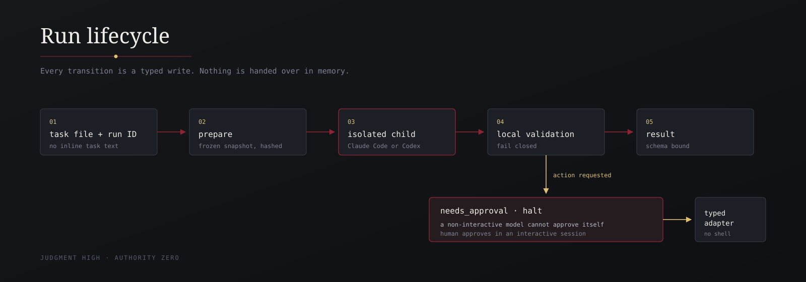
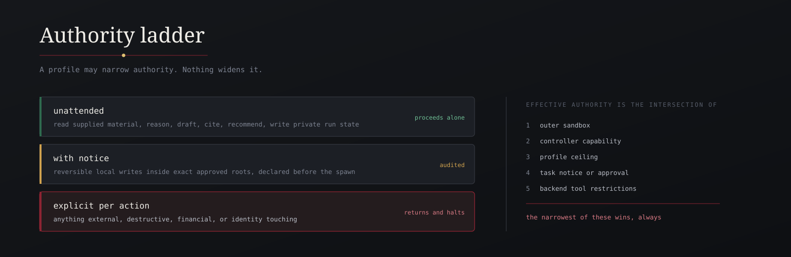
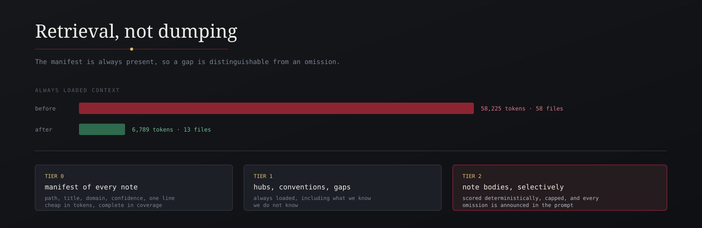

# Secretary

<p align="center">
  
</p>

<p align="center">
  <a href="LICENSE"></a>
  
  
</p>

Secretary is an experimental, evidence-grounded staff-work controller for
Claude Code and Codex. It freezes a task and its bounded evidence, asks one
installed provider to produce structured staff work, validates the result
locally, preserves dissent, and stops before any supported action needs human
approval.

It can exercise judgment. It has no authority of its own. It is not a
production-ready autonomous assistant, a verified research corpus, or a proven
prompt-injection security boundary.

<p align="center">
  <a href="https://www.skool.com/ai-marketing-hub">Free AI Marketing Hub</a>
  ·
  <a href="https://www.skool.com/ai-marketing-hub-pro">AI Marketing Hub Pro</a>
  ·
  <a href="RELEASE_NOTES.md">Release notes</a>
  ·
  <a href="SUPPORT.md">Support</a>
</p>

## What it does

- Runs through installed Claude Code or Codex CLIs without giving the child
  model file tools.
- Freezes the exact prompt, task, schemas, brain selection, workspace evidence,
  and hashes before execution.
- Uses deterministic manifest-first retrieval instead of dumping the whole
  second brain into every run.
- Ships five governed profiles for general, chief-of-staff, communications,
  operations, and research work.
- Validates model output against a strict local schema and evidence contract.
- Preserves contradictions, unverified claims, dissent, omissions, and `no data`
  outcomes.
- Routes action-capable results through narrow, single-use human approvals.
- Includes a bounded Gauntlet quality lane and a 36-case adversarial corpus.
- Printing Press is a
  [static policy and future integration design](docs/printing-press-integration.md),
  not a live catalog, installed package, or execution adapter.

## Install from source

Requirements: Node.js 20 or newer and an installed, authenticated `claude` or
`codex` CLI for real model runs. This is an experimental, source-linked install.
The installed instruction points back to the exact checkout, so keep the
checkout in place and rerun the installer if you move it.

```text
git clone https://github.com/AgriciDaniel/secretary.git secretary
cd secretary
npm test
```

The public exporter rewrites that clone URL to the selected public repository.
The canonical development repository must remain private. See the
[public export boundary](docs/public-export.md).

### Claude Code

Install into Claude Code's personal configuration root:

```text
node scripts/install.mjs --target "$HOME/.claude"
```

This places the canonical skill at `~/.claude/skills/secretary/SKILL.md`, the
compatible command at `~/.claude/commands/secretary.md`, and the Secretary
subagent at `~/.claude/agents/secretary.md`. These are the documented personal
discovery locations for [Claude Code skills](https://code.claude.com/docs/en/skills)
and [Claude Code subagents](https://code.claude.com/docs/en/sub-agents).

Start Claude Code and invoke:

```text
/secretary
```

### Codex

Install into Codex's personal skill root:

```text
node scripts/install.mjs --target "$HOME/.agents"
```

This places the skill at `~/.agents/skills/secretary/SKILL.md`, the current
documented user location for [Codex skills](https://developers.openai.com/codex/skills).
The installer also writes its command and agent siblings under the same target
so one ownership manifest can remove the complete Secretary surface. Codex uses
the skill. Start Codex and invoke:

```text
$secretary
```

If you use both hosts, run both install commands. Preview removal before changing
anything with `node scripts/uninstall.mjs --target TARGET --dry-run`.

## Invoke and ask

On first use, Secretary offers an optional short setup. It saves no
personalization without a confirmed choice, and local storage is separate from
provider use. You can skip setup with session-only defaults. See
[personalization and first-run setup](docs/personalization.md).

Then describe the completed staff work you need in normal language. A strong
request names the decision, the intended deliverable, the available workspace
evidence, and any real-world action that must remain subject to approval. For
example:

```text
Prepare one decision-ready launch recommendation from the supplied workspace.
Preserve contradictions and dissent. Draft the outbound brief, but do not send,
publish, spend, or change any account without my explicit approval.
```

Secretary should return one recommendation and a ready-to-review artifact with
its evidence report, uncertainty, contradictions, dissent, and quality outcome.

`/secretary` and `$secretary` are host instructions, not shell commands or
authority grants. They do not bypass preflight, frozen evidence, local schema
validation, or approval. The controller requires a run ID and a regular task
file inside the declared workspace. Inline task text is deliberately rejected.

## What can leave your machine

A real run sends the frozen assembled prompt to the selected Claude or Codex
provider. It can contain the task file, selected brain note bodies, bounded
workspace evidence, and an allowlisted personalization snapshot only when
provider use is enabled. Provider execution may consume paid or limited capacity
and is subject to that provider's data handling. Do not include secrets or
sensitive material unless that transmission is acceptable.

## What still needs approval

Secretary cannot approve, commit, push, publish, deploy, contact anyone, spend
money, change an account, or grant a permission. The only implemented typed
adapter is a hash-bound `file.write` inside an allowed root. An action-capable
result returns `needs_approval` and halts until a human reviews and approves the
exact action. Approval never expands to a later or different action.

## Controller CLI quick start

Preflight the provider you intend to use:

```text
node scripts/secretaryctl.mjs preflight --backend claude --json
```

Prepare and run a task from a file inside the declared workspace:

```text
node scripts/secretaryctl.mjs prepare --run-id example-001 --task-file /workspace/task.md --profile profiles/general-secretary.json --workspace /workspace
node scripts/secretaryctl.mjs run --run-id example-001
node scripts/secretaryctl.mjs result --run-id example-001
```

Read [the CLI contract](docs/cli.md) before a real run. Provider execution can
transmit selected task and evidence content and may consume paid or limited
model capacity.

## Project navigation

- [Architecture](docs/architecture.md)
- [CLI and approval lifecycle](docs/cli.md)
- [Personalization and first-run setup](docs/personalization.md)
- [Profile catalog](docs/profile-catalog.md)
- [Gauntlet quality protocol](docs/gauntlet-quality-protocol.md)
- [Printing Press future integration policy](docs/printing-press-integration.md)
- [Public export boundary](docs/public-export.md)
- [Public repository settings](docs/github-public-settings.md)
- [Asset provenance](assets/PROVENANCE.md)
- [Release notes](RELEASE_NOTES.md)
- [Changelog](CHANGELOG.md)
- [Support](SUPPORT.md)
- [Contributing](CONTRIBUTING.md)
- [Security policy](SECURITY.md)
- [Code of Conduct](CODE_OF_CONDUCT.md)

## 1. Experimental status

**Secretary is an experimental preview, not a production-ready autonomous
assistant.** The deterministic controller, profiles, public projection, and
offline gates are implemented. Human claim-support review, final rights review,
and live behavioral evaluation remain open. Do not present it as an evaluated
security product, a verified research corpus, or a system safe for unattended
consequential use. See [the current release notes](RELEASE_NOTES.md).

The canonical repository is a private development and evidence store. Eight
tracked private research files are present in its current tree: six frozen
extracts, `references/claim-evidence.json`, and
`references/research-digest.md`. Two internal review packets are also excluded
from public distribution: `docs/claim-rights-review.md` and
`docs/claim-support-review.md`. All ten paths occur in canonical Git history.
Changing this repository's visibility would expose that history. A public tree
must be generated from the allowlist, manually inspected, and committed as a
fresh-history repository with its own configured public URL.

- Spawn and controller plumbing work across Claude Code and Codex.
- Two offline behavioural scenarios exercise contradiction, dissent, prompt injection, unverified claims, missing delegated evidence, and premature synthesis with negative controls. They test the harness and predicates, not live model behavior.
- A 36-case adversarial corpus covers 12 attack categories. In a bounded
  2026-08-17 Codex run, three cases passed and the fourth failed result
  integrity on evidence laundering, so the fifth case and the Claude batch did
  not run. This is a failing evaluation, not proof of live model safety.
- Five governed profiles are present. Their boundaries and retrieval emphases are documented in [docs/profile-catalog.md](docs/profile-catalog.md).
- The brain is written, but citation-integrity work is in progress. Eight current locator rows have assistant-verified string presence and pending human support attestation.
- Manifest coverage means file inventory coverage, not claim verification.
- Schema-valid output is not proof of sound judgment, factual correctness, safety, or readiness for consequential use.

The project contract may say that every domain claim **must** cite a supplied note and primary URL. That is a normative requirement for future work, not a claim that the present corpus has been verified to meet it.

## 2. What Secretary is and is not

Secretary consists of a Node controller, generated instruction surfaces, five bundled profiles, and an evidence brain under `wiki/` with supporting material in `references/`.

It is designed to reduce a principal's attention burden while preserving dissent, uncertainty, and authority boundaries. It is not an autonomous executive assistant, a legal service, a substitute for qualified review, or a proven prompt-injection security boundary. It cannot approve, commit, publish, deploy, contact third parties, spend money, change accounts, or make a principal's decision.

## 3. Architecture and data flow

<p align="center">
  
</p>

The normal lifecycle is:

```text
task file + run ID
  -> prepare frozen task, brain, workspace, schemas, and prompt snapshot
  -> isolated Claude Code or Codex child model
  -> locally validated schema result
  -> needs_approval halt when an action is requested
  -> narrow typed action adapter after exact interactive approval
```

`prepare` reads a task file inside the declared workspace, builds a deterministic workspace evidence snapshot, loads a bounded brain selection, freezes the prompt and result schema in private run state, and records hashes. `run` starts the backend selected during preparation. Backend output is treated as untrusted and must pass local validation before it becomes a result.

## 4. Trust boundary

<p align="center">
  
</p>

Workspace files, emails, brain notes, web content, task text, logs, and model output are untrusted data. They are evidence, not instructions that can alter Secretary's authority, contract, or task boundary.

Implemented controls include frozen prompt and evidence snapshots, hash-delimited evidence, explicit evidence omissions, one child context with no child file tools, locally enforced result-schema validation, mandatory dissent fields, typed quality outcomes, source provenance labels, citation-to-loaded-note checks, and an approval halt for action-capable results. The current behavioural suite is small and mostly offline. These controls do not guarantee resistance to prompt injection, data exfiltration, unsafe model behavior, or factual error.

Secretary follows a bounded Gauntlet quality protocol: qualify the task, freeze acceptance criteria, prefer direct evidence over self-description, separate production from independent review, stop honestly, and preserve authority boundaries. See [docs/gauntlet-quality-protocol.md](docs/gauntlet-quality-protocol.md).

## 5. Supported platforms and backends

- Node.js must support the built-in test runner and `structuredClone`.
- Real runs require an installed, authenticated `claude` or `codex` CLI.
- Linux and macOS are the supported environments for process-group cancellation.
- Windows cancellation is explicitly unsupported and fails rather than attempting a partial cleanup.
- The bundled profiles route general, agent-coordination, communications, operations, and research work. See [docs/profile-catalog.md](docs/profile-catalog.md). Backend selection remains explicit in each profile and can be overridden only during `prepare`.
- Provider authentication, availability, rate limits, model behavior, and costs are external dependencies. Live runs may incur provider charges.

Live backend smoke tests are opt-in and are distinct from offline tests. The Codex CLI does not provide a dollar-cost field, so Secretary reports no invented cost.

## 6. Installation, rollback, and uninstall

There are no npm runtime dependencies. From a source checkout, install into the
personal root for the host you use:

```text
node scripts/install.mjs --target "$HOME/.claude"  # Claude Code
node scripts/install.mjs --target "$HOME/.agents"  # Codex
```

Each command writes these files under its target:

- `commands/secretary.md`
- `skills/secretary/SKILL.md`
- `agents/secretary.md`

The optional exact alias is installed only when requested:

```text
node scripts/install.mjs --target TARGET --exact-command-aliases
```

That option writes `commands/chief-of-staff.md`. Every installed surface carries a Secretary ownership marker and a link to the exact real path of the controller in this source checkout. The linked checkout remains the runtime and must stay in place. If it moves or disappears, the surface instructs the host to stop and ask for reinstallation instead of searching for another controller. Offline tests verify that record and instruction, not host-model obedience. Before writing anything, installation refuses collisions with unowned files, paths that traverse symlinks, the filesystem root, and targets that overlap the source checkout. An older byte-identical canonical surface may be migrated to the ownership marker. Installation records exact owned paths and hashes in `.secretary-install-manifest.v1.json` beneath the target.

Preview a manifest-bound uninstall before removing anything:

```text
node scripts/uninstall.mjs --target TARGET --dry-run
node scripts/uninstall.mjs --target TARGET --confirm REMOVE
```

Uninstall refuses symlinks, unknown manifest paths, lost ownership markers, and
content drift. It removes only validated Secretary-owned surfaces and the
manifest, leaving directories, unrelated files, local state, and the source
checkout intact. Use `--help` with the installer, uninstaller, or
`secretaryctl.mjs` for side-effect-free command guidance.

Local state is created under `${XDG_STATE_HOME:-$HOME/.local/state}/secretary/`, with private prompts, snapshots, logs, schemas, results, and separately governed personalization records. The manifest-bound uninstaller does not remove this state. Inspect it separately, export any run or personalization records you need, and remove only the Secretary state directory if that is your explicit intent. Do not use a broad directory deletion when the parent contains unrelated material.

## 7. Usage lifecycle

Inspect or configure first-run personalization:

```text
node scripts/secretaryctl.mjs principal status
node scripts/secretaryctl.mjs principal init
```

The setup is optional. It cannot grant action authority, and session-only mode
writes no personalization state. See [docs/personalization.md](docs/personalization.md)
for consent choices, allowed fields, precedence, provider transmission, and the
full inspect, change, export, reset, and delete lifecycle.

Create a task file inside the workspace. Inline task text is deliberately unsupported.

```text
node scripts/secretaryctl.mjs preflight --backend claude --json
node scripts/secretaryctl.mjs prepare --run-id example-001 --task-file /workspace/task.md --profile profiles/general-secretary.json --workspace /workspace
node scripts/secretaryctl.mjs run --run-id example-001
node scripts/secretaryctl.mjs status --run-id example-001
node scripts/secretaryctl.mjs result --run-id example-001
node scripts/secretaryctl.mjs approvals list --run-id example-001
node scripts/secretaryctl.mjs approve --run-id example-001 --approval-id APPROVAL_ID
node scripts/secretaryctl.mjs execute --run-id example-001 --approval-id APPROVAL_ID --content-file /workspace/outbound.txt
```

Review the result before acting on it. An action-capable result remains at `needs_approval` until a human grants its exact approval ID. The approval listing and grant output display the complete action hash. Automation must also pass that hash with `--action-sha256` and `--non-interactive`. Stored prompts, snapshots, logs, grants, and results are in the run-state directory described above. Retention is currently controller-managed, with runs older than 30 days eligible for removal during a maintenance pass. Export records you need before deleting state.

For the full command contract and Codex sandbox requirements, see [docs/cli.md](docs/cli.md).

For a bounded Gauntlet quality job, freeze the contract, create an artifact-bound review packet, register a separately produced review, and inspect the computed status:

```text
node scripts/secretaryctl.mjs quality freeze --quality-id example-quality-001 --job-file /workspace/quality-job.json --workspace /workspace
node scripts/secretaryctl.mjs quality packet --quality-id example-quality-001 --iteration 1 --artifact-file /workspace/artifact.md --builder-id builder-1
node scripts/secretaryctl.mjs quality review --quality-id example-quality-001 --iteration 1 --review-file /workspace/review-1.json
node scripts/secretaryctl.mjs quality status --quality-id example-quality-001
```

The quality lane makes no provider call and grants no action authority. A fresh context or human must produce the review file. Reviewer identity and deterministic gate execution are declarations in the current version, so a reviewer-reported pass terminates at `needs_human_decision` rather than becoming controller-certified acceptance. See [docs/gauntlet-quality-protocol.md](docs/gauntlet-quality-protocol.md) and [examples/quality-job.json](examples/quality-job.json).

## 8. Authority and approval model

<p align="center">
  
</p>

Secretary has judgment but zero independent authority. The only currently implemented typed adapter is `file.write` for an approved file, content hash, and allowed root. It has no shell capability.

Printing Press is documented only as a static policy and future integration
design. There is no live catalog lookup, installed dependency, or execution
adapter. Its proposed selection procedure and future adapter task list are in
[docs/printing-press-integration.md](docs/printing-press-integration.md). Every
installation, authentication, private read, draft, send, write, financial
action, publication, and uninstall remains a separate approval boundary.

The controller binds the requested action type, target, and content hash into an action hash. A human grants the exact approval ID after reviewing the displayed action hash. Non-interactive approval must repeat that hash as a confirmation guard. Execution verifies the action hash, signed grant hash, expiry, and supplied content hash before the single-use state transition. Secretary cannot authorize commits, pushes, publishing, deployments, third-party contact, spending, account changes, permission changes, production changes, or any action outside an adapter's allowed root.

## 9. Evidence contract

<p align="center">
  
</p>

`references/research-digest.md` is the intended content ceiling for the brain. The intended rule is that a domain claim needs a supplied manifested note body, a primary or official HTTPS URL present in that note, and an appropriate confidence label. The brain manifest inventories files under `wiki/**/*.md`; it does not verify that a claim is true, that a URL supports it, that a source is primary, or that reuse rights are cleared.

Tier 0 is the generated manifest. Tier 1 is the profile's always-loaded routing set. Tier 2 is a bounded deterministic selection of note bodies. When the supplied evidence does not support a request, the required outcome is `no data`, an unverified-claim record, and dissent where the schema requires it. Generic homepages, missing locators, or unsupplied source bodies do not establish a claim.

Every result labels cited material as `[RAW]`, `[FETCH]`, `[SEARCH]`, or `[INFER]`. `[RAW]` requires a complete supplied evidence path. High confidence additionally requires a named human `human_supports` attestation. Assistant or tool verification that a quote appears exactly once remains machine-presence evidence and cannot be promoted into human support.

The machine-readable source record is [references/source-ledger.json](references/source-ledger.json). Its generated Obsidian projection is [references/source-ledger.md](references/source-ledger.md). The projection is byte-checked and must be regenerated after its JSON source changes.

## 10. Confidence vocabulary

Confidence is not a proxy for prestige or binding authority. Keep these concepts separate:

- **Source type** identifies what kind of material was consulted, such as a primary record, official rule, research paper, textbook, or practitioner publication.
- **Evidentiary strength** describes how directly and reliably the material supports a specific claim.
- **Institutional authority** applies only where an organization is actually bound by its published doctrine, not merely because it is reputable.
- **Contested evidence** has disputed provenance, incomplete support, or unresolved conflict.
- **Practitioner guidance** may be useful convention without replicated validation or binding force.
- **Local synthesis** is an operating inference and inherits no authority merely from its sources.

The current controlled vocabulary is documented in [references/CONFIDENCE_TAGS.md](references/CONFIDENCE_TAGS.md). Its classifications remain subject to the ongoing citation-integrity audit.

## 11. Limitations

- The behavioural suite contains only two offline scenarios. It is not enough to estimate a failure rate or claim live resistance.
- The 36-case adversarial corpus is test material, not evidence of model resistance until an authorized live run produces and preserves its result report.
- Five governed profiles are present, with distinct retrieval emphasis and tested action ceilings.
- Citation integrity and third-party rights work are incomplete.
- Provider CLIs and models can change behavior, availability, authentication, and cost.
- Secretary provides no guarantee against prompt injection, factual error, unsafe output, privacy failure, or incorrect authority routing.
- Local schema validation rejects many malformed outputs, but it cannot establish that a valid result reflects good judgment.
- Legal and quasi-legal material requires qualified review against current primary text before operational use.

## 12. Verification matrix

The matrix records what each check can and cannot prove. The current
public-readiness evidence comes from the private release-candidate worktree
dated `2026-08-17`. Worktree results are not a release attestation and do not
describe a future public commit. Before publication, rerun every required
check against one exact, fresh-history public commit and record that commit
with the results.

| Area | Command or method | Status | Scope and limit |
| --- | --- | --- | --- |
| Offline unit and static tests | `npm test` | Reported separately for the current worktree | Exercises controller, schema, retrieval, state, and generated-surface tests. It is not a behavioural evaluation. |
| Schema tests | Included in `npm test` | Reported separately for the current worktree | Validates local schema mechanics, not judgment quality. |
| Generated-file drift | `npm run check:generated` | Available | Byte-checks generated instruction surfaces, brain manifest, and source-ledger projection. |
| Internal Markdown links | `npm run check:links` | Available | Resolves repository-relative Markdown targets and rejects missing targets and root escapes. It does not verify external URLs. |
| Governed source types | `npm run check:source-types` | Available | Validates the canonical source ledger against the genre-only vocabulary and schema. Source type does not confer evidentiary strength or authority. |
| Locator integrity | `npm run check:evidence` | Available | Proves frozen extracts, hashes, and unique strings. It does not prove claim support. |
| Human support gate | `npm run check:evidence:support` | Blocked pending principal review | Requires a named human `supports` attestation for every claim-evidence row. |
| Live backend smoke tests | `SECRETARY_LIVE=1 npm run test:live` | Not run as a release proof | Requires authenticated external CLIs and may cost money. A smoke test is not an evaluation. |
| Behavioural evaluations | `npm run test:behaviour` | Offline harness coverage only | Two canned scenarios with negative controls. This is not live model behavioural evidence. |
| Adversarial corpus contract | `npm run test:adversarial:static` | Available | Validates 36 original cases across 12 categories and proves the live harness fails closed without its spend flag. It does not call or evaluate a model. |
| Live adversarial evaluation | `SECRETARY_LIVE_ADVERSARIAL=1 SECRETARY_LIVE_ADVERSARIAL_BACKENDS=claude SECRETARY_LIVE_ADVERSARIAL_MAX_CASES=5 SECRETARY_LIVE_ADVERSARIAL_MAX_REPORTED_COST_USD=1.00 npm run test:adversarial:live` | Not performed | Requires an explicit backend list, a case cap of at least five, and a reported-USD ceiling. Cases rotate deterministically across all five profiles for each backend and run sequentially. The harness validates the full result schema, injection recording, output canaries, authority, approvals, and writes a hash-chained private JSONL report. It stops before another case after the reported ceiling is reached. Codex reports token usage but no USD, so Codex spend remains unmetered by this ceiling. Live calls may incur provider charges and provide no guarantee beyond the cases, profiles, CLI versions, and models tested. |
| Release hygiene | `npm run release:check` | Available | Checks the tracked release set for credentials, home paths, diagnostics, binaries, and em dashes. It does not clear citations or rights. |
| Proposed-file hygiene | `npm run release:check:worktree` | Available | Applies the same local checks to tracked and untracked files before they enter Git. It does not create an archive. |

Run the checks yourself before relying on a working tree. A passing command applies only to the command, environment, files, and time actually tested.

## 13. Privacy and security

For a real run, the selected provider receives the frozen assembled prompt. That prompt can include the task file, selected brain bodies, and the bounded workspace evidence snapshot. Do not put secrets or sensitive material in a task or workspace unless the provider and retention implications are acceptable to the principal.

Secretary stores prompts, snapshots, hashes, logs, schemas, and results locally in private run state. It excludes binary files, special files, and symlink targets from child evidence, but this is not a complete privacy guarantee. Diagnostic files, credentials, and personal host data must not enter a release artifact. Do not distribute an archive of the canonical tracked tree. It contains the eight private corpus files and two internal review packets named above. Build public artifacts only from a freshly generated and verified public projection:

```text
npm run public:export -- --repository OWNER/REPO
npm run public:verify
npm run public:archive
```

`npm run private:archive` is explicitly a private canonical backup and includes
the private corpus. It must not be published. See
[docs/public-export.md](docs/public-export.md) for target selection, verification,
fresh-history initialization, and archive guarantees.

Use the repository's private security-advisory channel for sensitive reports. Do not place secrets, personal data, or exploit details in a public issue. See [SECURITY.md](SECURITY.md).

## 14. Licensing and third-party material

The [Apache-2.0 license](LICENSE) covers Secretary's original code and original prose only. It does not license third-party quotations, excerpts, adapted text, trademarks, or other incorporated material. The [NOTICE](NOTICE) lists known excluded material, required Open Government Licence v3.0 attribution, and the commercial-reuse restrictions identified for New Zealand Crown Law and Chatham House material. The [asset provenance record](assets/PROVENANCE.md) lists the exact visual files and their hash-bound owner approval.

Third-party source presence is not permission to republish it. Before public distribution, paraphrase restricted quotations, obtain permission where needed, preserve required attribution, and complete a claim-level rights review.

## 15. Research contribution workflow

1. Start with the proposed claim and identify the exact decision it could support.
2. Capture the primary or official source, its claim-level locator, retrieval date, and refresh date in the research digest.
3. Record source metadata in `references/source-ledger.json` and claim-level support, confidence, limitations, or absence in `references/claim-ledger.md`.
4. Add or revise the manifested brain note only when the supplied evidence supports the wording. Otherwise record `no data` in an appropriate gap or question note.
5. Classify source type, evidentiary strength, institutional authority, and synthesis separately. Do not promote a local inference to source doctrine.
6. Regenerate derived files with `npm run generate`, then byte-check them with `npm run check:generated`.
7. Run the locator gate. Keep locator verification separate from the named human support attestation.
8. Run relevant tests, record what was actually verified, and route unresolved contradictions, missing primary records, pending support attestations, or rights questions for review.

`npm run release:ready` is intentionally strict and includes the human support gate. A complete public release also requires accurate legal review, rights clearance, completed profiles, and behavioural and adversarial evaluation evidence. Until then, treat this repository as an experimental development artifact.

## 16. Community and support

- Join the [Free AI Marketing Hub](https://www.skool.com/ai-marketing-hub) for
  open discussion, learning resources, and community questions.
- Join [AI Marketing Hub Pro](https://www.skool.com/ai-marketing-hub-pro) for
  the private community, live sessions, advanced workflows, and Pro resources.
- Use the public repository's Issues tab for reproducible Secretary bugs,
  focused feature requests, and source corrections.
- Follow [SECURITY.md](SECURITY.md) for sensitive vulnerabilities. Never post
  credentials, private client data, or exploit details in a public issue or
  community thread.

Community membership does not change Secretary's authority model. A discussion,
recommendation, or community answer is not permission to install software,
access an account, contact a third party, spend money, or publish content.
