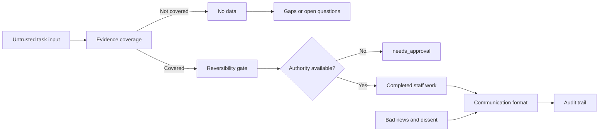

# Secretary Brain Catalogue

## Read order

Start with [[hot]], then the domain hub tied to the task, then the relevant substantive note.
Use [[references/claim-ledger]] to check confidence and single-source exposure.
Use [[references/source-ledger]] to check source dates and refresh deadlines.
If the requested claim is unsupported, return `no data` and consult [[gaps/_index]] and [[questions/_index]].

## Link taxonomy

| Domain | Hub | Operating purpose |
| --- | --- | --- |
| Communication | [[communication/_index]] | Briefings, decision writing, bad news, and no-surprises notices |
| Judgment | [[judgment/_index]] | Reversibility, priority, delegation, triage, forecasting, and stopping rules |
| Secondary tool discovery | [[judgment/Printing Press Tool Discovery]] | Identify one focused CLI while keeping setup and provider actions separately approved |
| Escalation | [[escalation/_index]] | Capability and authority routing, assertiveness, thresholds, CCIR, and contingencies |
| Ethics | [[ethics/_index]] | Authority, confidentiality, status disclosure, attribution, and public-service values |
| Duties | [[duties/_index]] | Time-use baseline, correspondence flow, and planning horizons |
| Roles | [[roles/_index]] | Completed staff work and the secretary's authority boundary |
| Failure modes | [[failure-modes/_index]] | Mindguarding, dissent loss, private-office failure, and AI-specific hazards |
| Gaps | [[gaps/_index]] | Verified absences and corrected attributions |
| Questions | [[questions/_index]] | Open items that the digest cannot answer |

## Priority

The IAAP job analysis assigns 24 percent to organizational communication and 22 percent to business writing and document production, for 46 percent combined (https://www.iaap-hq.org/page/certification_older).
Scheduling is not a top-level domain in that analysis.
The brain therefore goes deepest in [[communication/_index]] and [[judgment/_index]], followed by [[escalation/_index]], [[ethics/_index]], and [[duties/_index]].

## Control notes

- [[meta/CONVENTIONS]] defines frontmatter, citation, and no-data rules.
- [[meta/Tag Taxonomy]] defines permitted tags.
- [[hot]] holds the current operating context.
- [[log]] records changes newest first.
- [[references/CONFIDENCE_TAGS]] defines the evidence vocabulary.
